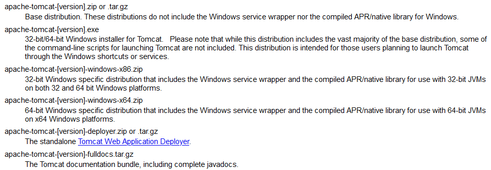
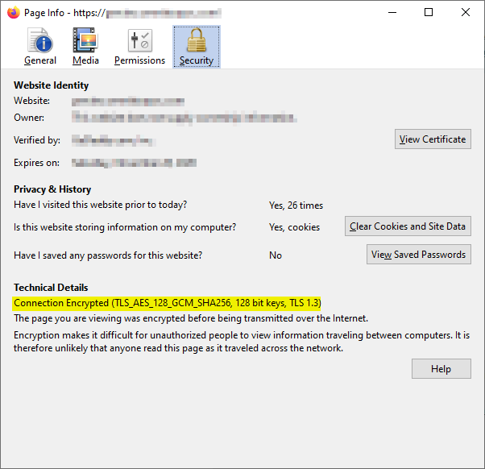

# TLS v1.3 in Tomcat.
Options to enable TLS v1.3 in Tomcat v8.5+.

## Option 1 - Upgrade Java version
* Tomcat can support TLS v1.3 via JSSE when Java version >= 11
  * http://openjdk.java.net/jeps/332
  * https://bugs.openjdk.java.net/browse/JDK-8202625
* It works on Windows and Unix-like platform.

## Option 2 - Use latest OpenSSL
* Tomcat can support TLS v1.3 via OpenSSL when OpenSSL version >= 1.1.1
  * https://wiki.openssl.org/index.php/TLS1.3
* Microsoft Windows platform
  * Required
    * Tomcat with APR/native library
      
* CentOS
  * Required
    * CentOS version >= 8
      * CentOS-7 has built-in OpenSSL v1.0.2k FIPS, which is not support TLS v1.3.
        * You can't use yum to update to newer OpenSSL.
        * Tomcat still loads built-in OpenSSL
          * Can't use yum to remove built-in OpenSSL completely, and no any updates for it via yum.
          * Can't completely replace built-in OpenSSL with manually newer OpenSSL installation.
    * apr apr-util apr-devel packages
    * tomcat-native pakcage

## Step-by-step (CentOS-8 example)
Learn how to setup TLS v1.3 with freshly installed CentOS-8, OpenJDK JRE 1.8, and Tomcat v8.5.54 for test only.
To simplify, root account is used.
1. Update system if needed:
   ```shell script
   yum install epel-release -y
   yum update -y
   reboot
   ```
1. Install JRE:
   ```shell script
   yum install java-1.8.0-openjdk -y
   java -version
   ```
1. Install Tomcat:
   ```shell script
   mkdir /opt/tomcat
   cd /tmp
   wget http://ftp.mirror.tw/pub/apache/tomcat/tomcat-8/v8.5.54/bin/apache-tomcat-8.5.54.tar.gz
   tar -zxvf apache-tomcat-8.5.54.tar.gz -C /opt/tomcat --strip-components=1
   ```
1. Enable tomcat service:
   ```shell script
   vi /etc/systemd/system/tomcat.service
   ```
   Add below:
   ```properties
   [Unit]
   Description=Apache Tomcat Web Application Container
   After=syslog.target network.target

   [Service]
   Type=forking

   Environment=JAVA_HOME=/usr/lib/jvm/jre
   Environment=CATALINA_PID=/opt/tomcat/temp/tomcat.pid
   Environment=CATALINA_HOME=/opt/tomcat
   Environment=CATALINA_BASE=/opt/tomcat
   Environment='CATALINA_OPTS=-Xms512M -Xmx1024M -server -XX:+UseParallelGC'
   Environment='JAVA_OPTS=-Djava.awt.headless=true -Djava.security.egd=file:/dev/./urandom'

   ExecStart=/opt/tomcat/bin/startup.sh
   ExecStop=/bin/kill -15 $MAINPID

   User=root
   Group=root

   [Install]
   WantedBy=multi-user.target
   ```
   ```shell script
   systemctl enable tomcat.service
   ```
1. Open port in firewall:
   ```shell script
   firewall-cmd --zone=public --permanent --add-port=8080/tcp  --add-port=443/tcp
   firewall-cmd --reload
   ```
1. [Install APR](https://blog.csdn.net/ClementAD/article/details/47320037):
   ```shell script
   yum install apr apr-util apr-devel -y
   ls -l /usr/bin/apr-1-config
   ```
1. Install Tomcat native (search by [pkgs.org](https://pkgs.org/)):
   ```shell script
   yum install -y https://download-ib01.fedoraproject.org/pub/epel/8/Everything/x86_64/Packages/t/tomcat-native-1.2.23-1.el8.x86_64.rpm
   ```
1. Setup server.xml:
   ```shell script
   cd /opt/tomcat/conf
   cp -pr server.xml server.xml.bak
   ```
   * add "TLSv1.3" to "protocols" attribute.
   * add below to "ciphers" attribute
     * TLS_AES_128_GCM_SHA256
     * TLS_AES_256_GCM_SHA384
   * set "TLS" to "sslProtocol" attribute.
   
   See [server_sample.xml](server_sample.xml) for details.
1. Start Tomcat
   ```shell script
   systemctl start tomcat.service
   ```
1. Make sure TLS v1.3 is enabled
   * You should see below messages in catalina.log:
     ```
     INFO [main] org.apache.catalina.core.AprLifecycleListener.lifecycleEvent Loaded APR based Apache Tomcat Native library [1.2.23] using APR version [1.6.3].
     INFO [main] org.apache.catalina.core.AprLifecycleListener.lifecycleEvent APR capabilities: IPv6 [true], sendfile [true], accept filters [false], random [true].
     INFO [main] org.apache.catalina.core.AprLifecycleListener.lifecycleEvent APR/OpenSSL configuration: useAprConnector [false], useOpenSSL [true]
     INFO [main] org.apache.catalina.core.AprLifecycleListener.initializeSSL OpenSSL successfully initialized [OpenSSL 1.1.1c FIPS  28 May 2019]
     INFO [main] org.apache.coyote.AbstractProtocol.init Initializing ProtocolHandler ["http-nio-8080"]
     INFO [main] org.apache.tomcat.util.net.NioSelectorPool.getSharedSelector Using a shared selector for servlet write/read
     INFO [main] org.apache.coyote.AbstractProtocol.init Initializing ProtocolHandler ["https-openssl-nio2-443"]
     ```
   * Connect to your web site and check the connection details:
     


